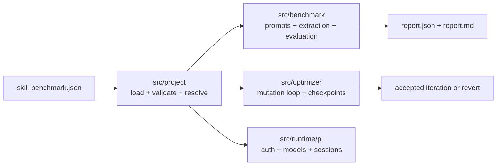

# skill-optimizer

Benchmark and optimization framework for measuring whether LLMs choose the right SDK methods, CLI commands, or MCP tools from documentation and task prompts.

The public model is a single project config: `skill-benchmark.json`.

## What It Does

- supports `sdk`, `cli`, and `mcp` targets
- benchmarks model behavior with static extraction and matching only
- can generate benchmark tasks from docs plus a declared target surface
- can run a checkpointed optimization loop over allowed files in a target repo
- uses Pi-based model/runtime integration for both benchmarking and optimization
- supports both stable-surface and surface-changing optimization modes

## Current Model

The current surface model is unified around `target.discovery`.

- preferred: code-first discovery from real target sources
- current reliable fallback: explicit manifests and declared surface metadata

Current code-first discovery support:

- `sdk`: exported classes, constructors, methods, and exported functions from TypeScript/JavaScript source files
- `cli`: exported literal command arrays from TypeScript/JavaScript source files
- `mcp`: exported literal MCP tool definitions from TypeScript/JavaScript source files

Transitional explicit manifests still exist in parts of the codebase as internal fallback/compatibility paths, but the intended public direction is code-first discovery for all three surfaces.

## Architecture



Key layers:

- `src/project/`: unified config loading, validation, path resolution
- `src/runtime/pi/`: shared Pi auth/model/runtime helpers
- `src/tasks/`: shared discovery-backed task generation, grounding, and freezing
- `src/benchmark/`: task loading, prompting, extraction, evaluation, reporting
- `src/optimizer/`: mutation loop, failure analysis, validation, checkpoints

## Static Benchmark Guarantee

Benchmark evaluation is static.

- extracted code, commands, and tool calls are matched structurally
- generated code is not executed
- generated shell commands are not executed
- optimizer mutation happens outside the benchmark phase

## Install

```bash
npm install skill-optimizer
```

## Quick Start

Scaffold a new project config:

```bash
npx skill-optimizer init
```

This creates:

- `skill-benchmark.json`
- `tasks.json`
- `tools.json`

Run a benchmark:

```bash
export OPENROUTER_API_KEY=sk-or-...
npx skill-optimizer run --config ./skill-benchmark.json
```

Generate and freeze tasks only:

```bash
npx skill-optimizer generate-tasks --config ./skill-benchmark.json
```

Run the optimizer:

```bash
npx skill-optimizer optimize --config ./skill-benchmark.json
```

## Unified Config

Example `skill-benchmark.json`:

```json
{
  "name": "my-mcp-project",
  "target": {
    "surface": "mcp",
    "repoPath": ".",
    "skill": "./SKILL.md",
    "discovery": {
      "mode": "manifest",
      "fallbackManifest": "./tools.json"
    }
  },
  "benchmark": {
    "format": "pi",
    "apiKeyEnv": "OPENROUTER_API_KEY",
    "models": [
      { "id": "openrouter/openai/gpt-5.4", "name": "GPT-5.4", "tier": "flagship" }
    ],
    "tasks": "./tasks.json",
    "taskGeneration": {
      "enabled": false,
      "maxTasks": 10,
      "seed": 1,
      "outputDir": "./.skill-optimizer"
    },
    "output": {
      "dir": "./benchmark-results"
    }
  },
  "optimize": {
    "enabled": true,
    "mode": "stable-surface",
    "model": "openrouter/openai/gpt-5.4",
    "apiKeyEnv": "OPENROUTER_API_KEY",
    "thinkingLevel": "medium",
    "allowedPaths": ["SKILL.md", "README.md"],
    "validation": [],
    "maxIterations": 5,
    "stabilityWindow": 2,
    "minImprovement": 0.01,
    "reportContextMaxBytes": 16000
  }
}
```

## Surface Config

### Unified Discovery Block

All surfaces use the same discovery shape:

```json
{
  "target": {
    "surface": "mcp",
    "repoPath": ".",
    "skill": "./SKILL.md",
    "discovery": {
      "mode": "auto",
      "sources": ["./src/server.ts"],
      "fallbackManifest": "./tools.json"
    }
  }
}
```

Fields:

- `mode`: `auto` or `manifest`
- `sources`: code or entry files to inspect
- `fallbackManifest`: explicit surface file when code-first discovery is incomplete

For all three surfaces, `mode: "auto"` with `sources` pointing at real source files is now the preferred path.

### SDK

```json
{
  "target": {
    "surface": "sdk",
    "repoPath": ".",
    "skill": "./SKILL.md",
    "discovery": {
      "mode": "auto",
      "sources": ["./src/index.ts"],
      "language": "typescript"
    },
    "sdk": {
      "language": "typescript"
    }
  }
}
```

Supported `target.sdk.language` values:

- `typescript`
- `python`
- `rust`

### CLI

```json
{
  "target": {
    "surface": "cli",
    "repoPath": ".",
    "skill": "./SKILL.md",
    "discovery": {
      "mode": "auto",
      "sources": ["./src/commands.ts"]
    }
  }
}
```

### MCP

```json
{
  "target": {
    "surface": "mcp",
    "repoPath": ".",
    "skill": "./SKILL.md",
    "discovery": {
      "mode": "auto",
      "sources": ["./src/server.ts"]
    }
  }
}
```

## Task Generation

Task generation currently powers the optimize flow and the shared generation pipeline.

For task generation, the system reads:

- docs/guidance like `SKILL.md`
- the discovered `SurfaceSnapshot` for the target

and then:

1. generates candidate tasks with Pi
2. grounds them against the declared MCP tools
3. freezes them under the configured artifact directory

Within one optimize run, the task set is frozen and reused for every rerun so score changes stay comparable.

## Tasks

Public task terminology is action-based.

```json
{
  "tasks": [
    {
      "id": "comment-ticket",
      "prompt": "Add a comment to TK-42 saying the issue is reproduced.",
      "expected_actions": [
        {
          "name": "add_cmnt",
          "args": {
            "tkt": "TK-42",
            "body": "Issue reproduced."
          }
        }
      ]
    }
  ]
}
```

`expected_tools` is still accepted as a transitional input alias, but `expected_actions` is the preferred public schema.

## Optimizer Behavior

The optimizer loop is:

1. baseline benchmark
2. failure analysis
3. coding-agent mutation inside `allowedPaths`
4. validation
5. rerun benchmark
6. accept or revert
7. repeat until stable or max iterations

### Optimization modes

#### `stable-surface`

Use when the callable surface should stay fixed during the run.

Typical edits:

- `SKILL.md`
- docs
- examples
- help text

Benchmark reruns stay on the same frozen surface snapshot and task set.

#### `surface-changing`

Use when the orchestrator is allowed to rename or reshape the callable surface itself.

Examples:

- MCP tool renames like `get_tkt -> get_ticket`
- CLI command renames
- SDK API renames

When an accepted mutation changes the callable surface, the optimizer:

1. rediscovers the surface
2. freezes a new `surface.snapshot.json`
3. regenerates tasks
4. starts a new benchmark epoch baseline

Direct score comparison is only meaningful within a single epoch.

Safety properties:

- target repo must start clean when optimization is enabled
- only `allowedPaths` may be edited
- optimizer-owned artifacts under the configured task-generation output directory are ignored as framework output
- rejected or failed iterations restore the last accepted checkpoint

### What the orchestrator actually edits

The orchestrator edits whatever files are listed in `optimize.allowedPaths`.

In the current `mcp-tracker-demo`, that is only:

- `SKILL.md`

So the orchestrator currently improves guidance and usage instructions, not the callable MCP surface itself.

### Why surface renames are different

Within a single optimize run, the benchmark surface snapshot and generated tasks are frozen.

That makes score comparisons trustworthy, but it also means surface-changing edits like:

- renaming an MCP tool from `get_tkt` to `get_ticket`
- renaming a CLI command
- renaming an SDK method

should not be treated as a normal in-run mutation against the same frozen benchmark definition.

Those changes require:

1. accepting the mutation
2. rediscovering the surface
3. re-freezing the surface snapshot
4. regenerating or revalidating tasks

That is a separate optimization mode from the current stable-surface loop.

To enable real surface renames, set `optimize.mode` to `surface-changing` and include the actual implementation files in `allowedPaths`.

`stabilityWindow` means: stop after `N` consecutive iterations without a meaningful improvement.

## CLI Reference

```text
skill-optimizer init
skill-optimizer generate-tasks [options]
skill-optimizer benchmark [options]
skill-optimizer run [options]
skill-optimizer optimize [options]
skill-optimizer compare [options]
```

### `run` options

- `--config <path>`
- `--tier <flagship|mid|low>`
- `--task <task-id>`
- `--model <slug>`
- `--no-cache`

### `optimize` options

- `--config <path>`
- `--max-iterations <n>`
- `--skip-generation`

### `generate-tasks` options

- `--config <path>`

### `compare` options

- `--baseline <path>`
- `--current <path>`

## Mock Repo

This repo includes `mock-repos/mcp-tracker-demo/`, which is the current end-to-end optimizer example.

Materialize it before running so git checkpointing stays isolated:

```bash
npx tsx src/optimizer/materialize-mock-repo.ts mcp-tracker-demo ./.tmp/mock-repos
npx skill-optimizer optimize --config ./.tmp/mock-repos/mcp-tracker-demo/skill-benchmark.json
```

That mock repo now discovers its MCP surface from `src/server.ts` and runs in `surface-changing` mode.

## Local Development

```bash
npm run build
npm run typecheck
npm test
npm pack --dry-run
```

Inspect the CLI locally:

```bash
npx tsx src/cli.ts --help
```

## Notes

- the current public config is `skill-benchmark.json`
- Pi examples in this repo typically use `OPENROUTER_API_KEY`
- benchmark extraction/evaluation is static even when Pi is used for model/runtime integration
- code-first discovery is the intended default direction, with manifest files currently serving as reliable fallback inputs

## License

MIT
