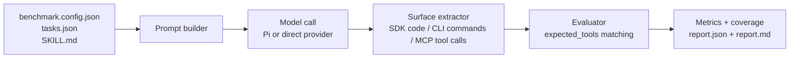
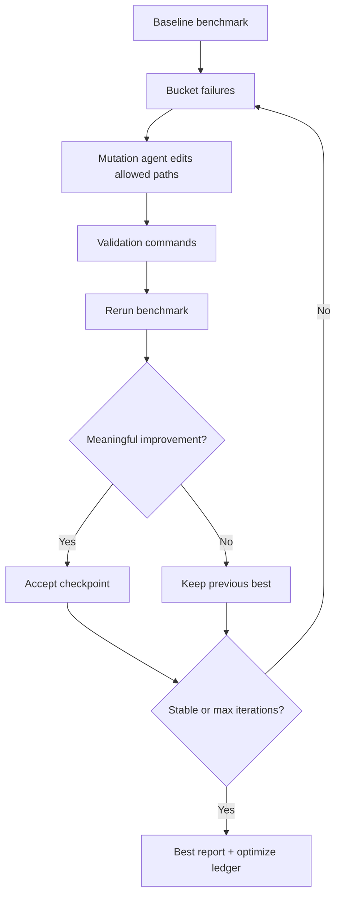

# skill-optimizer

Surface-driven benchmark and optimization framework for measuring whether LLMs choose the right SDK methods, CLI commands, or MCP tools from documentation and task prompts.

The repository has two layers:

- `src/benchmark/*`: the benchmark harness that runs tasks, extracts actions, and scores results
- `src/optimizer/*`: the sequential self-improvement loop that reruns the benchmark while mutating an allowed target repo

Key properties:

- Supports `sdk`, `cli`, and `mcp` evaluation surfaces
- Uses static extraction and matching only; generated code and commands are not executed
- Produces benchmark reports you can compare over time
- Can optimize a target repo or skill file inside a constrained, checkpointed loop

## Architecture



## Optimizer Loop



## Surfaces

| Surface | Config field | Expected model output | Transport |
|---|---|---|---|
| `sdk` | `surface: "sdk"` | One fenced code block matching `sdk.language` | Pi or direct chat |
| `cli` | `surface: "cli"` | One fenced `bash`/`sh` block with commands only | Pi or direct chat |
| `mcp` | `surface: "mcp"` | Tool calls only | Pi or direct tool-calling chat |

`cli` and `mcp` are implementation-language-agnostic. Only `sdk` cares about code language because the model output is parsed as source code.

## How It Works

1. Load the benchmark config, task set, and optional `skill.source` context.
2. Build a surface-specific prompt contract for `sdk`, `cli`, or `mcp`.
3. Send prompts to each configured model.
4. Extract actions from model output.
5. Compare those actions to `expected_tools` in each task.
6. Compute benchmark metrics such as recall, precision, argument accuracy, hallucination rate, and coverage.

## Quick Start

Install and scaffold a new benchmark:

```bash
npm install skill-optimizer
npx skill-optimizer init
```

Run a benchmark:

```bash
export OPENROUTER_API_KEY=sk-or-...
npx skill-optimizer run
npx skill-optimizer run --task send-data --model gpt-5-4
```

The default examples use `llm.format: "pi"`. For OpenRouter-backed benchmark requests, keep `OPENROUTER_API_KEY` set and use model ids like `openrouter/openai/gpt-5.4`. If you are running the optimizer interactively, the recommended path is Pi subscription auth via `pi /login`.

## Running the Optimizer

The optimizer expects a clean git repo for the target and only edits files listed in `targetRepo.allowedPaths`.

For local testing, this repo currently includes `mock-repos/mcp-tracker-demo`, a richer MCP example that is designed to make `SKILL.md` quality matter.

Materialize a standalone copy before running the optimizer so checkpointing stays isolated from the tracked template:

```bash
tsx src/optimizer/materialize-mock-repo.ts mcp-tracker-demo ./.tmp/mock-repos
pi /login # choose OpenAI Codex / GPT-5.4 for the orchestrator
tsx src/optimizer/main.ts ./.tmp/mock-repos/mcp-tracker-demo/optimize.config.json
```

Useful optimizer flags:

- `--max-iterations <n>`: override the manifest iteration cap
- `--skip-generation`: disable task generation even if the manifest enables it

`optimize` runs a benchmark, diagnoses failures, asks a coding agent to mutate the target repo, validates the candidate, reruns the benchmark, and stops when results stabilize or `maxIterations` is reached. The default iteration cap is `5`.

## Benchmark Configuration

### SDK Surface

```json
{
  "name": "my-sdk",
  "surface": "sdk",
  "sdk": {
    "language": "typescript",
    "apiSurface": ["MyClient.constructor", "MyClient.getBalance", "MyWallet.send"]
  },
  "skill": {
    "source": "github:myorg/my-sdk/SKILL.md",
    "cache": true
  },
  "tasks": "./tasks.json",
  "llm": {
    "apiKeyEnv": "OPENROUTER_API_KEY",
    "format": "pi",
    "models": [
      { "id": "openrouter/openai/gpt-5.4", "name": "GPT-5.4", "tier": "flagship" }
    ]
  }
}
```

Supported `sdk.language` values:

| Language | Fence tag | Notes |
|---|---|---|
| `typescript` | `typescript` / `ts` | Best-covered SDK language in the current harness |
| `python` | `python` / `py` | Supports constructors, bound methods, keyword args, lists, and dict literals |
| `rust` | `rust` / `rs` | Supports associated functions, bound methods, and struct-literal args; complex macros and builder chains degrade to dynamic values |

Python SDK example:

```json
{
  "name": "my-python-sdk",
  "surface": "sdk",
  "sdk": {
    "language": "python",
    "apiSurface": ["FastClient.constructor", "FastWallet.from_keyfile", "FastWallet.send"]
  },
  "tasks": "./tasks.json",
  "llm": {
    "apiKeyEnv": "OPENROUTER_API_KEY",
    "format": "pi",
    "models": [
      { "id": "openrouter/openai/gpt-5.4", "name": "GPT-5.4", "tier": "flagship" }
    ]
  }
}
```

Rust SDK example:

```json
{
  "name": "my-rust-sdk",
  "surface": "sdk",
  "sdk": {
    "language": "rust",
    "apiSurface": ["FastClient.new", "FastWallet.from_keyfile", "FastWallet.send"]
  },
  "tasks": "./tasks.json",
  "llm": {
    "apiKeyEnv": "OPENROUTER_API_KEY",
    "format": "pi",
    "models": [
      { "id": "openrouter/openai/gpt-5.4", "name": "GPT-5.4", "tier": "flagship" }
    ]
  }
}
```

### CLI Surface

```json
{
  "name": "my-cli",
  "surface": "cli",
  "cli": {
    "commands": "./commands.json"
  },
  "skill": {
    "source": "./SKILL.md"
  },
  "tasks": "./tasks-cli.json",
  "llm": {
    "apiKeyEnv": "OPENROUTER_API_KEY",
    "format": "pi",
    "models": [
      { "id": "openrouter/openai/gpt-5.4", "name": "GPT-5.4", "tier": "flagship" }
    ]
  }
}
```

Example `commands.json`:

```json
[
  {
    "command": "fast deploy",
    "description": "Deploy an app",
    "options": [
      { "name": "name", "takesValue": true },
      { "name": "env", "takesValue": true }
    ]
  },
  {
    "command": "fast logs",
    "description": "Fetch logs",
    "options": [
      { "name": "service", "takesValue": true }
    ]
  }
]
```

### MCP Surface

```json
{
  "name": "my-mcp-tools",
  "surface": "mcp",
  "mcp": {
    "tools": "./tools.json"
  },
  "tasks": "./tasks-mcp.json",
  "llm": {
    "apiKeyEnv": "OPENROUTER_API_KEY",
    "format": "pi",
    "models": [
      { "id": "openrouter/openai/gpt-5.4", "name": "GPT-5.4", "tier": "flagship" }
    ]
  }
}
```

### Optimize Manifest

```json
{
  "benchmarkConfig": "./benchmark.config.json",
  "targetRepo": {
    "path": ".",
    "surface": "sdk",
    "allowedPaths": ["src", "docs", "examples", "README.md"],
    "validation": ["node ./scripts/validate.mjs"],
    "requireCleanGit": true
  },
  "optimizer": {
    "maxIterations": 5,
    "stabilityWindow": 2,
    "minOverallPassDelta": 0.01,
    "taskGeneration": {
      "enabled": false,
      "maxGenerated": 10,
      "seed": 1,
      "outputDir": "./.skill-optimizer"
    }
  },
  "mutation": {
    "provider": "openrouter",
    "model": "openai/gpt-5.4",
    "thinkingLevel": "medium",
    "apiKeyEnv": "OPENROUTER_API_KEY",
    "reportContextMaxBytes": 16000
  }
}
```

## `skill.source` Behavior

`skill.source` is optional guidance context. It is included in prompts as reference material; it is not itself the evaluation target format.

Supported formats:

- `github:org/repo/path/to/SKILL.md`
- local file path such as `./SKILL.md`
- URL such as `https://example.com/skill.md`

## Tasks

Tasks are surface-agnostic and always use `expected_tools` for expected action names and arguments.

```json
{
  "tasks": [
    {
      "id": "send-tokens",
      "prompt": "Send 5 tokens to addr1...",
      "expected_tools": [
        { "method": "send_tokens", "args": { "to": "addr1...", "amount": "5" } }
      ]
    }
  ]
}
```

## CLI Reference

```text
skill-optimizer init
skill-optimizer run [options]
skill-optimizer compare [options]
```

Run options:

- `--config <path>`
- `--tier <flagship|mid|low>`
- `--task <task-id>`
- `--model <slug>`
- `--no-cache`

Compare options:

- `--baseline <path>`
- `--current <path>`

## Metrics

- **Tool Recall**: expected actions found / expected actions
- **Tool Precision**: matched actions / extracted known actions
- **Tool Selection Accuracy**: expected action names found, ignoring arguments
- **Argument Accuracy**: argument correctness when the action name matched
- **Task Pass Rate**: all expected actions and args matched
- **Hallucination Rate**: surface-aware unknown action rate
- **Coverage**: known surface actions represented by tasks

## Project Structure

```text
src/
  cli.ts                CLI entrypoint
  benchmark/
    runner.ts           Surface-driven benchmark execution loop
    prompts.ts          Surface prompt contracts (sdk/cli/mcp)
    evaluator.ts        Matching and surface-aware hallucination logic
    reporter.ts         Markdown and console reporting
    compare.ts          Report-to-report diffing
    init.ts             Config and task scaffolding
    llm/                Provider adapters and transports
    extractors/         Surface extractors and SDK language adapters
  optimizer/
    main.ts             Optimizer CLI entrypoint
    loop.ts             Sequential benchmark-driven improvement loop
    manifest.ts         Optimizer manifest loading and validation
    mock-repos.ts       Template materialization helpers
    mutation/           Mutation execution and report context helpers
```

## Local Development

```bash
npm run build
npm run typecheck
npm test
```

To inspect the CLI locally:

```bash
npx tsx src/cli.ts --help
```

## Notes

- Reports are written under `benchmark-results/` by default unless `output.dir` overrides that location.
- The optimizer records its run ledger under the configured task-generation output directory.
- `llm.format` supports `pi`, `openai`, and `anthropic`, but the examples in this repo are centered on the Pi flow.
- Keep benchmark docs aligned with the actual CLI and config shape; stale examples are easy to cargo-cult into downstream repos.
